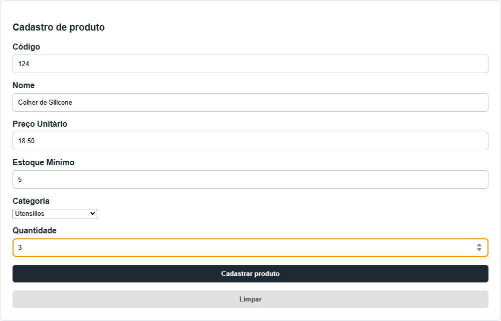
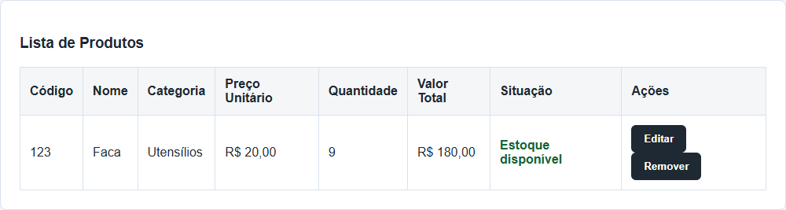
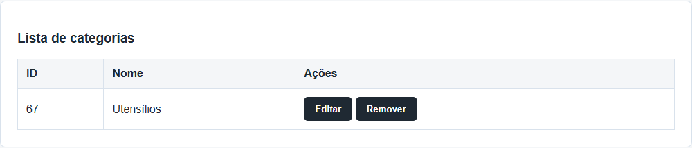
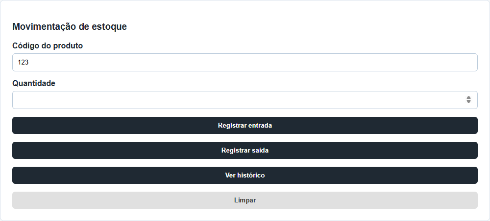
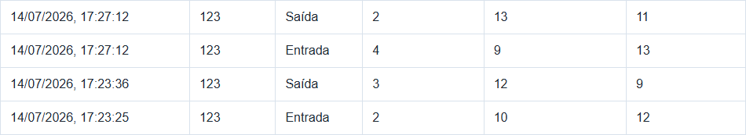

# Mini ERP - Controle de Produtos e Estoque

## Sobre o projeto

Este projeto é um Mini ERP simples para controle de produtos e estoque. Ele foi construído em três partes: primeiro uma versão em console com C#, depois uma versão web usando HTML, CSS e JavaScript e, por fim, uma API com ASP.NET Core.

A ideia principal foi criar um sistema pequeno, mas completo o suficiente para praticar cadastro, listagem, busca, validações, cálculos de estoque e manipulação de dados na tela.

## Arquitetura da aplicação

O Mini ERP possui uma interface web, uma API e um banco de dados. O fluxo principal de uma ação do usuário é:

```text
Usuário -> HTML/CSS/JavaScript -> api.js/fetch -> API ASP.NET Core -> Services -> Entity Framework Core -> SQLite
```

Cada parte possui uma responsabilidade:

- **Frontend:** mostra formulários, tabelas e mensagens; recebe as ações do usuário e exibe os dados retornados pela API.
- **`api.js`:** concentra as chamadas HTTP com `fetch` e o tratamento padrão das respostas da API.
- **API ASP.NET Core:** recebe requisições, valida os dados, define respostas HTTP e chama os services.
- **Services:** aplicam as regras de negócio, como código único, categoria ou fornecedor existente, saldo suficiente e histórico de movimentações.
- **Entity Framework Core:** mapeia as entidades C# e traduz operações da aplicação para o banco de dados.
- **SQLite:** armazena produtos, categorias, fornecedores e movimentações no arquivo local do banco.

Produtos, categorias, fornecedores e movimentações usam a API e o SQLite como fonte única de dados. O `localStorage` foi removido do fluxo principal para evitar que a tela apresente alterações que não foram persistidas no servidor.

## Versão em C#

A primeira parte do projeto foi feita em C# com .NET. Essa versão roda pelo terminal e concentra a lógica principal do sistema.

Nela é possível:

- cadastrar produtos;
- listar produtos cadastrados;
- buscar produto por código;
- calcular o valor total do estoque;
- editar produto;
- remover produto;
- visualizar um resumo do estoque;
- listar produtos com estoque baixo;
- buscar produtos por nome.

Essa etapa ajudou a praticar estruturas básicas de programação, como `if`, `switch`, `while`, `foreach`, listas, objetos e validações de entrada.

## Versão web

Depois da versão em console, foi criada uma interface web para representar o sistema de forma visual.

A página possui formulário de cadastro, indicadores, busca por código, tabela de produtos, mensagens para o usuário e botões de ação.

Com JavaScript, a tela passou a funcionar diretamente no navegador. A versão web permite:

- cadastrar produtos pela tela;
- validar os campos informados;
- impedir código duplicado;
- atualizar a tabela automaticamente;
- calcular o valor total de cada produto;
- atualizar os indicadores do estoque;
- buscar produtos por código;
- limpar a busca;
- remover produtos com confirmação;
- mostrar a situação do estoque.

Com a evolução para regras de ERP, a tela também permite:

- cadastrar, editar e remover categorias;
- vincular obrigatoriamente cada produto a uma categoria;
- configurar o estoque mínimo de cada produto;
- registrar entradas e saídas de estoque;
- consultar o histórico de movimentações;
- bloquear saídas que deixariam o saldo do produto negativo.







### Atualizações recentes das funções da tela

Além das funções já existentes, a versão web recebeu melhorias no fluxo de ações da tabela e do formulário:

- editar produto diretamente pela tabela;
- remover produto com confirmação;
- alterar o botão de cadastro para "Salvar alteração" durante a edição;
- bloquear temporariamente o campo de código durante a edição para evitar inconsistências;
- limpar o modo de edição ao salvar ou ao clicar em limpar formulário;
- buscar produtos por código ou nome;
- executar busca pressionando Enter no campo de busca.

Fluxo da edição de produto:

1. Ao clicar em Editar, os dados do item voltam para o formulário.
2. O sistema entra em modo de edição e altera o texto do botão principal.
3. Após salvar, os dados são atualizados na lista, a tabela é renderizada novamente e os indicadores são recalculados.
4. O modo de edição é encerrado e o formulário retorna ao estado normal.

## Estrutura visual da versão web

Na parte de HTML, a página foi organizada em seções para deixar o sistema mais fácil de entender e usar. A estrutura possui cabeçalho, área de indicadores, formulário de cadastro, campo de busca, tabela de produtos e rodapé.

O formulário foi montado com campos para código, nome, preço e quantidade. Cada campo possui `label`, `id` e `name`, o que ajuda tanto na organização da tela quanto na integração com o JavaScript.

A tabela foi criada para exibir os produtos cadastrados e também mostrar informações calculadas, como valor total e situação do estoque. O corpo da tabela recebeu um `id` para que o JavaScript consiga limpar e montar as linhas conforme os produtos forem cadastrados, buscados ou removidos.

No CSS, a interface recebeu uma aparência simples e organizada, com cores neutras, seções em formato de blocos, bordas leves, espaçamentos internos e botões padronizados. A ideia foi deixar a tela parecida com um módulo básico de sistema, sem depender de bibliotecas externas.

Também foi adicionada responsividade. Os indicadores usam grid para ficarem lado a lado em telas maiores e se ajustarem em telas menores. A tabela possui rolagem horizontal quando necessário, evitando que o conteúdo quebre em telas pequenas.

As mensagens e os status de estoque também receberam classes CSS próprias. Com isso, o sistema consegue diferenciar visualmente mensagens de sucesso, mensagens de erro, produtos sem estoque, produtos com estoque baixo e produtos disponíveis.

## Organização do código JavaScript

No começo, todo o JavaScript da versão web ficava em um único arquivo. Conforme o projeto cresceu, o código foi separado em arquivos menores, cada um com uma responsabilidade clara. A ideia foi deixar o projeto mais fácil de ler, manter e evoluir, seguindo a mesma linha de separação de responsabilidades que foi aplicada na versão em C#.

Hoje a parte web está organizada assim:

- `dom-elements.js`: centraliza a captura dos elementos da tela, deixando os demais arquivos livres de chamadas repetidas de seleção de elementos;
- `ui.js`: concentra as funções que desenham e atualizam a interface, como montar a tabela, atualizar os indicadores e exibir mensagens;
- `api.js`: concentra todas as chamadas HTTP disponíveis na interface para produtos, categorias e movimentações, além do tratamento padrão de respostas e falhas de conexão;
- `produto-controller.js`: reúne o estado, as regras e os eventos das ações de cadastrar, editar, remover e buscar;
- `categoria-controller.js`: controla o cadastro, a edição e a remoção de categorias;
- `movimentacao-controller.js`: valida e registra entradas, saídas e consultas de histórico;
- `app.js`: serve apenas como ponto de entrada, iniciando a aplicação.

Além da separação, a montagem da tabela também foi melhorada. No lugar de gerar HTML em texto com `innerHTML`, as linhas passaram a ser criadas com `document.createElement`, `textContent` e `appendChild`. Os botões de ação deixaram de usar `onclick` direto no HTML e passaram a ser ligados com `addEventListener`, deixando o comportamento controlado pelo JavaScript.

Quando a API está indisponível, `api.js` transforma a falha técnica de conexão em uma mensagem compreensível. A tela não grava, altera ou remove dados somente no navegador.

## Regras do sistema

O sistema aplica algumas regras para evitar cadastros inválidos:

- o código precisa ser maior que zero;
- não pode haver dois produtos com o mesmo código;
- o nome do produto não pode ficar vazio;
- o preço precisa ser maior que zero;
- a quantidade não pode ficar vazia;
- a quantidade não pode ser negativa.
- todo produto deve possuir uma categoria existente;
- não é possível remover uma categoria vinculada a produtos;
- um produto pode ter fornecedor opcional, mas o fornecedor informado deve existir e estar ativo;
- código e documento de fornecedor não podem ser duplicados;
- não é possível remover um fornecedor vinculado a produtos;
- uma saída de estoque não pode ser maior que o saldo disponível;
- o estoque mínimo não pode ser negativo.

A quantidade igual a zero é permitida, pois representa um produto cadastrado, mas sem unidades em estoque.

Quando a quantidade atual é menor ou igual ao estoque mínimo configurado, a tabela exibe o alerta de estoque baixo.

## API e regras de ERP

Além da versão em console e da versão web, o projeto também possui uma API criada com ASP.NET Core Minimal API.

A versão web consome a API usando `fetch`, centralizado em `miniErpWeb/js/api.js`. A API e o banco SQLite são a fonte única de dados. Se o backend estiver indisponível, a interface informa o problema sem exibir mensagens técnicas como `Failed to fetch` e sem alterar dados localmente.

Os endpoints de criação e edição recebem DTOs de entrada (`ProdutoRequest`, `CategoriaRequest` e `FornecedorRequest`). No limite da API, esses dados são mapeados para as entidades persistidas e encaminhados aos services, que aplicam as regras de negócio.

A API possui os seguintes endpoints:

| Método | Rota | Descrição |
|---|---|---|
| GET | `/produtos` | Lista todos os produtos cadastrados |
| GET | `/produtos/{codigo}` | Busca um produto pelo código |
| POST | `/produtos` | Cadastra um novo produto |
| PUT | `/produtos/{codigo}` | Edita um produto existente |
| DELETE | `/produtos/{codigo}` | Remove um produto existente |
| GET | `/produtos/estoque-baixo` | Lista produtos com estoque no mínimo ou abaixo dele |
| GET | `/produtos/{codigo}/movimentacoes` | Lista o histórico de movimentações de um produto |
| POST | `/produtos/{codigo}/movimentacoes/entrada` | Registra uma entrada de estoque |
| POST | `/produtos/{codigo}/movimentacoes/saida` | Registra uma saída de estoque |
| GET | `/categorias` | Lista categorias |
| GET | `/categorias/{id}` | Busca uma categoria pelo identificador |
| POST | `/categorias` | Cadastra uma categoria |
| PUT | `/categorias/{id}` | Edita uma categoria |
| DELETE | `/categorias/{id}` | Remove uma categoria sem produtos vinculados |
| GET | `/fornecedores` | Lista fornecedores |
| GET | `/fornecedores/{id}` | Busca fornecedor pelo identificador |
| POST | `/fornecedores` | Cadastra fornecedor |
| PUT | `/fornecedores/{id}` | Edita fornecedor |
| DELETE | `/fornecedores/{id}` | Remove fornecedor sem produtos vinculados |

Exemplo de JSON usado no cadastro e na edição:

```json
{
  "codigo": 101,
  "nome": "Teclado",
  "precoUnitario": 120,
  "quantidadeEstoque": 5,
  "estoqueMinimo": 2,
  "categoriaId": 1,
  "fornecedorId": null
}
```

A API também possui validações para evitar dados inválidos:

- o código precisa ser maior que zero;
- o nome do produto não pode ficar vazio;
- o preço unitário precisa ser maior que zero;
- a quantidade em estoque não pode ser negativa;
- o estoque mínimo não pode ser negativo;
- a categoria informada deve existir;
- quando informado, o fornecedor deve existir e estar ativo;
- não pode haver dois produtos com o mesmo código;
- na edição, o código da URL precisa ser igual ao código enviado no corpo da requisição.

O fornecedor possui código, nome, documento, e-mail e status ativo/inativo. O código e o documento são únicos, o e-mail deve ser válido e a associação com produto é opcional.

As movimentações recebem uma quantidade inteira maior que zero. Entradas aumentam o saldo, saídas reduzem o saldo e cada operação gera um histórico com data, tipo, quantidade, saldo anterior e saldo novo. A API bloqueia saídas que excedem o saldo disponível.





Algumas respostas esperadas da API:

| Situação | Resposta |
|---|---|
| Produto cadastrado com sucesso | `201 Created` |
| Produto editado com sucesso | `200 OK` |
| Produto removido com sucesso | `204 No Content` |
| Produto não encontrado | `404 Not Found` |
| Código duplicado no cadastro | `409 Conflict` |
| Dados inválidos | `400 Bad Request` |

## Banco de dados SQLite

A API utiliza SQLite com Entity Framework Core para persistir os produtos. Os dados ficam armazenados no arquivo:

```text
MiniErp.Api/Dados/mini-erp.db
```

Esse arquivo é criado automaticamente ao executar a migration e não é versionado no Git.

O contexto de banco está definido em `MiniErp.Api/Data/AppDbContext.cs` e os arquivos de migration ficam em `MiniErp.Api/Migrations/`.

Para criar ou atualizar o banco após clonar o repositório, execute:

```bash
dotnet ef database update --project MiniErp.Api --startup-project MiniErp.Api
```

Comportamento atual da persistência com SQLite:

- ao iniciar a API, os dados são carregados diretamente do banco SQLite;
- ao cadastrar um produto, o registro é inserido no banco;
- ao editar um produto, os dados são atualizados no banco;
- ao remover um produto, o registro é excluído do banco;
- ao reiniciar a API, todos os dados continuam disponíveis.

As migrations também mantêm a evolução do esquema. Quando a relação entre produtos e categorias foi adicionada, os produtos existentes foram associados automaticamente à categoria padrão `Sem categoria`, evitando dados sem vínculo.

## Tecnologias utilizadas

- C#
- .NET 10
- ASP.NET Core Minimal API
- Entity Framework Core
- SQLite
- HTML
- CSS
- JavaScript
- Git

## Estrutura do projeto

```text
projeto erp/
├── Program.cs
├── Produto.cs
├── ProjetoErp.csproj
├── index.html
├── README.md
├── MiniErp.Api/
│   ├── Data/
│   │   └── AppDbContext.cs
│   ├── DTOs/
│   │   ├── CategoriaRequest.cs
│   │   ├── FornecedorRequest.cs
│   │   └── ProdutoRequest.cs
│   ├── Migrations/
│   ├── Models/
│   │   ├── Categoria.cs
│   │   ├── Fornecedor.cs
│   │   ├── MovimentacaoEstoque.cs
│   │   ├── MovimentacaoEstoqueRequest.cs
│   │   └── Produto.cs
│   ├── Services/
│   │   ├── CategoriaService.cs
│   │   ├── FornecedorService.cs
│   │   ├── MovimentacaoEstoqueService.cs
│   │   └── ProdutoService.cs
│   ├── Program.cs
│   ├── MiniErp.Api.csproj
│   └── MiniErp.Api.http
├── miniErpWeb/
│   ├── index.html
│   ├── css/
│   │   └── style.css
│   ├── js/
│   │   ├── app.js
│   │   ├── api.js
│   │   ├── categoria-controller.js
│   │   ├── dom-elements.js
│   │   ├── movimentacao-controller.js
│   │   ├── produto-controller.js
│   │   └── ui.js
│   └── assets/
└── .gitignore
```

## Como executar a versão em C#

Pré-requisito: .NET SDK 10 instalado. No terminal, na raiz do projeto, execute:

```bash
dotnet restore
dotnet run --project ProjetoErp.csproj
```

## Como executar a API

Pré-requisito: .NET SDK 10 instalado. Na raiz do projeto, restaure as dependências e aplique as migrations antes da primeira execução:

```bash
dotnet restore MiniErp.Api/MiniErp.Api.csproj
dotnet ef database update --project MiniErp.Api --startup-project MiniErp.Api
```

Depois, inicie a API:

```bash
dotnet run --project MiniErp.Api
```

Por padrão, a API pode ser acessada localmente em:

```text
http://localhost:5208
```

O arquivo `MiniErp.Api/MiniErp.Api.http` possui exemplos de requisições para listar, buscar, cadastrar, editar e remover produtos.

## Como abrir a versão web

Depois que o GitHub Pages estiver ativado, a versão web poderá ser acessada por este link:

[Acessar versão web publicada](https://fernando-0904.github.io/mini---erp/)

O arquivo `index.html` da raiz serve apenas para redirecionar o GitHub Pages para a pasta da aplicação web.

Para abrir localmente, use o arquivo abaixo diretamente no navegador:

[miniErpWeb/index.html](miniErpWeb/index.html)

No GitHub, o link local acima abre o arquivo HTML dentro do repositório. O link do GitHub Pages abre a aplicação funcionando como página web.

Para testar a integração completa localmente, inicie a API e sirva a pasta `miniErpWeb` com um servidor HTTP, por exemplo:

```bash
npx --yes http-server miniErpWeb -p 5500 -c-1
```

Depois, abra `http://127.0.0.1:5500` no navegador. A API deve permanecer em execução para que a aplicação consulte e altere os dados.

Para iniciar a aplicação do zero, siga esta ordem:

1. Execute a migration e inicie a API em um terminal.
2. Em outro terminal, execute o servidor HTTP da pasta `miniErpWeb`.
3. Abra `http://127.0.0.1:5500` e confirme que a tela carrega os dados da API em `http://localhost:5208`.

## Testes automatizados

O projeto `MiniErp.Api.Tests` usa xUnit e SQLite em memória para validar as regras de negócio sem alterar o banco de dados local. Atualmente, a suíte possui 23 testes automatizados.

| Regra validada | Resultado esperado |
|---|---|
| Cálculo do valor total | Multiplica corretamente preço unitário pela quantidade em estoque |
| Cadastro válido | Permite cadastrar produto com dados corretos |
| Código duplicado | Impede o cadastro de dois produtos com o mesmo código |
| Categoria obrigatória | Rejeita produto sem categoria |
| Categoria existente | Rejeita categoria inexistente no produto |
| Preço inválido | Rejeita preço menor ou igual a zero |
| Quantidade negativa | Rejeita estoque inicial negativo |
| Estoque mínimo negativo | Rejeita estoque mínimo negativo |
| Edição de produto | Preserva o saldo de estoque; alterações de quantidade exigem movimentação |
| Entrada de estoque | Atualiza o saldo e cria o registro de histórico |
| Saída válida | Reduz o saldo e gera histórico |
| Saída com saldo insuficiente | Bloqueia a movimentação e preserva o saldo e o histórico |
| Histórico por produto | Retorna apenas as movimentações do produto consultado |
| Cadastro de fornecedor | Permite fornecedor com dados válidos |
| Código ou documento duplicado | Impede fornecedores duplicados |
| E-mail de fornecedor inválido | Rejeita e-mail inválido |
| Status de fornecedor | Persiste fornecedor inativo |
| Vínculo opcional | Permite produto sem fornecedor |
| Fornecedor em produto | Detecta produto vinculado e valida fornecedor inexistente ou inativo |
| Edição de fornecedor no produto | Persiste a troca do fornecedor associado |

Para executar a suíte:

```bash
dotnet test MiniErp.Api.Tests/MiniErp.Api.Tests.csproj
```

O workflow do GitHub Actions executa essa mesma suíte em cada `push` e `pull request`.

## Fluxo de revisão

O fluxo atual publica mudanças diretamente na `master` depois das validações adequadas. Quando for necessário usar uma pull request, registre o resumo, o tipo de alteração, como testar, as evidências e o checklist da revisão.

Antes de publicar uma alteração, recomenda-se executar os testes relevantes, verificar `git diff --check`, atualizar o README quando necessário e conferir se não há erros no console do navegador ou no terminal da API.

## Testes manuais realizados

| Cenário | Entrada | Resultado esperado | Status |
|---|---|---|---|
| Cadastro válido | Código 101, nome Teclado, preço 120, quantidade 5 | Produto cadastrado, exibido na tabela e indicadores atualizados | OK |
| Código duplicado | Cadastrar outro produto com código 101 | Sistema exibe erro e não cadastra o produto | OK |
| Código inválido | Código vazio, zero, negativo ou decimal | Sistema exibe erro de código inválido | OK |
| Nome vazio | Nome em branco | Sistema exibe erro e não cadastra o produto | OK |
| Preço inválido | Preço vazio, zero, negativo ou texto inválido | Sistema exibe erro de preço inválido | OK |
| Quantidade inválida | Quantidade vazia, negativa, decimal ou texto inválido | Sistema exibe erro de quantidade inválida | OK |
| Quantidade zero | Código válido, nome válido, preço válido, quantidade 0 | Produto cadastrado como sem estoque | OK |
| Busca por código existente | Buscar código de produto cadastrado | Sistema exibe o produto encontrado | OK |
| Busca por nome existente | Buscar parte do nome de produto cadastrado | Sistema exibe os produtos compatíveis | OK |
| Busca sem resultado | Buscar código ou nome inexistente | Sistema exibe mensagem de nenhum produto encontrado | OK |
| Edição válida | Editar nome, preço e quantidade com valores válidos | Produto atualizado na tabela e indicadores recalculados | OK |
| Edição com campo inválido | Informar campo inválido durante edição | Sistema exibe erro e não salva a alteração | OK |
| Remoção confirmada | Clicar em Remover e confirmar | Produto removido da tabela e indicadores atualizados | OK |
| Remoção cancelada | Clicar em Remover e cancelar | Produto permanece cadastrado | OK |
| Persistência após atualizar página | Cadastrar produto e pressionar F5 com a API em execução | Produto continua listado porque foi salvo no SQLite | OK |

## Testes manuais da integração com API

Depois da criação da API, a versão web passou a usar os endpoints do back-end para listar, cadastrar, editar, remover e buscar produtos por código. A API e o SQLite são a fonte única dos dados.

Testes com a API ligada:

| Cenário | Entrada | Resultado esperado | Status |
|---|---|---|---|
| Listagem pela API | Abrir a tela com a API rodando | Sistema carrega os produtos usando `GET /produtos` | OK |
| Cadastro pela API | Código 101, nome Teclado, preço 120, quantidade 5 | Produto cadastrado usando `POST /produtos` e exibido na tabela | OK |
| Código duplicado pela API | Cadastrar outro produto com código 101 | API retorna conflito e o produto não é cadastrado novamente | OK |
| Cadastro inválido pela API | Nome vazio, preço zero ou quantidade negativa | API retorna erro de validação e o produto não é cadastrado | OK |
| Edição pela API | Editar nome, preço, categoria ou estoque mínimo de produto existente | Produto atualizado usando `PUT /produtos/{codigo}`; o saldo é preservado | OK |
| Remoção pela API | Remover produto existente e confirmar | Produto removido usando `DELETE /produtos/{codigo}` | OK |
| Busca por código pela API | Buscar código 101 | Produto encontrado usando `GET /produtos/{codigo}` | OK |
| Busca por código inexistente | Buscar código 999 | Sistema informa que nenhum produto foi encontrado | OK |
| Busca por nome | Buscar parte do nome do produto | Sistema mantém a busca local por nome usando os dados carregados | OK |
| CORS da API | Frontend chamar `http://localhost:5208` | API permite a chamada do navegador | OK |

Teste com a API desligada:

| Cenário | Entrada | Resultado esperado | Status |
|---|---|---|---|
| Falha de conexão | Abrir a tela ou tentar uma operação com a API desligada | Interface informa que não foi possível conectar à API e não altera dados apenas no navegador | OK |

Observações da integração:

- a API salva os produtos, categorias e movimentações no SQLite;
- o `localStorage` não participa do fluxo de dados do ERP;
- a busca por nome continua local porque a API atual possui busca apenas por código.

## Testes manuais da persistência no SQLite

Depois da adoção do SQLite, foram testados cenários para confirmar que os dados continuam disponíveis mesmo após reiniciar a API.

| Cenário | Entrada | Resultado esperado | Status |
|---|---|---|---|
| Build da API | Executar build do projeto `MiniErp.Api` | Compilação concluída sem erros | OK |
| Cadastro persistido | Cadastrar produto com código 9901 | API retorna `201 Created` e salva o produto no SQLite | OK |
| Carregamento após reiniciar | Reiniciar a API e buscar o código 9901 | API retorna `200 OK` e encontra o produto cadastrado antes do reinício | OK |
| Edição persistida | Editar nome, preço, categoria ou estoque mínimo do produto 9901 | API retorna `200 OK` e salva os novos dados no SQLite, preservando o saldo | OK |
| Carregamento da edição após reiniciar | Reiniciar a API e buscar novamente o código 9901 | API retorna o produto com os dados editados | OK |
| Remoção persistida | Remover o produto 9901 | API retorna `204 No Content` e atualiza o SQLite | OK |
| Remoção após reiniciar | Reiniciar a API e buscar o código 9901 | API retorna `404 Not Found`, confirmando que o produto não voltou | OK |

Resultado observado nos testes:

```text
Cadastro inicial: HTTP 201
Busca após reiniciar: HTTP 200, Produto Persistência
Edição: HTTP 200
Busca após reiniciar edição: HTTP 200, Produto Persistência Editado, R$ 150, qtd 7
Remoção: HTTP 204
Busca após reiniciar remoção: HTTP 404
```

## Testes manuais das regras de ERP

| Cenário | Entrada | Resultado esperado | Status |
|---|---|---|---|
| Categoria obrigatória | Cadastrar produto sem selecionar categoria | Frontend bloqueia o cadastro e solicita uma categoria válida | OK |
| Categoria inexistente | Enviar produto com `categoriaId` inexistente para a API | API retorna `400 Bad Request` com mensagem de categoria inexistente | OK |
| Produto com categoria | Cadastrar produto selecionando uma categoria válida | Produto é salvo, a categoria aparece na tabela e o vínculo é retornado pela API | OK |
| Edição de categoria | Alterar a categoria de um produto existente | Produto passa a exibir a nova categoria na tabela | OK |
| Categoria em uso | Tentar remover categoria vinculada a produto | API bloqueia a remoção e exibe mensagem explicativa | OK |
| Estoque mínimo | Produto com quantidade igual ou menor que o mínimo | Tabela exibe situação de estoque baixo | OK |
| Entrada de estoque | Registrar entrada de 4 unidades em produto com saldo 5 | Saldo passa para 9, indicadores atualizam e histórico registra a entrada | OK |
| Saída de estoque | Registrar saída de 2 unidades em produto com saldo 9 | Saldo passa para 7, indicadores atualizam e histórico registra a saída | OK |
| Saída sem saldo | Registrar saída maior que o saldo disponível | API bloqueia a operação e não altera o estoque | OK |
| Histórico | Consultar histórico após entrada e saída | Tela mostra data, tipo, quantidade, saldo anterior e saldo novo | OK |
| Persistência de regras ERP | Reiniciar API após cadastrar produto e movimentar estoque | Produto, categoria e saldo permanecem no SQLite | OK |

## Maiores dificuldades

A maior dificuldade foi entender a integração do JavaScript com a página.

Foi nessa parte que ficaram os pontos mais importantes do projeto web: capturar os dados do formulário, validar as informações, montar a tabela dinamicamente, atualizar os indicadores, controlar os botões de busca e remoção, mostrar mensagens na tela e integrar o frontend com a API.

Essa etapa exigiu entender melhor como o JavaScript conversa com o HTML e como cada ação do usuário precisa alterar alguma parte da página.

## O que foi praticado

Durante o desenvolvimento, foram praticados:

- lógica de programação;
- criação de menus no console;
- leitura e validação de dados;
- uso de classes e objetos em C#;
- manipulação de listas;
- criação de estrutura HTML;
- estilização com CSS;
- organização visual com seções, formulários, indicadores e tabela;
- responsividade básica para telas menores;
- eventos no JavaScript;
- manipulação do DOM;
- criação de elementos da tabela com `createElement`, `textContent` e `appendChild`;
- separação do JavaScript em arquivos por responsabilidade;
- tratamento de erro no carregamento de dados com `try/catch`;
- criação de API com ASP.NET Core Minimal API;
- criação de endpoints HTTP para produtos;
- validação de dados recebidos pela API;
- persistência com SQLite e Entity Framework Core;
- criação e aplicação de migrations;
- relacionamento entre produtos e categorias;
- movimentações de estoque com histórico e validação de saldo;
- versionamento com Git e envio para o GitHub.

## Próximos passos possíveis

- melhorar alguns detalhes visuais da interface;
- reorganizar a solução em camadas de backend, frontend, domínio e testes;

---

Projeto desenvolvido como prática de aprendizado em desenvolvimento de software.
