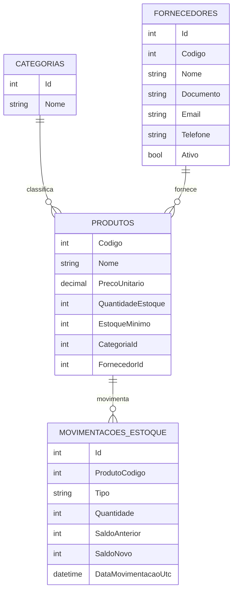

# Semana 1: Mapeamento do banco de dados

## Objetivo
Entender a estrutura atual do banco de dados do MiniERP, identificando tabelas, campos, chaves, relacionamentos e regras refletidas no banco.

## Tabelas do MiniERP
Tabelas principais do domínio:
- Produtos
- Categorias
- Fornecedores
- MovimentaçõesEstoque

Tabela técnica do EF Core (controle de migrations):
- __EFMigrationsHistory

## Produtos
### Objetivo
Armazenar os produtos cadastrados no MiniERP.

### Campos
| Campo | Tipo | Obrigatório | Observação |
|---|---|---|---|
| Codigo | int | Sim | Chave primária |
| Nome | string (TEXT) | Sim | Nome do produto |
| PrecoUnitario | decimal (TEXT no SQLite) | Sim | Preço do produto |
| QuantidadeEstoque | int | Sim | Saldo atual |
| EstoqueMinimo | int | Sim | Limite mínimo de reposição |
| CategoriaId | int | Sim | FK para Categorias.Id |
| FornecedorId | int? | Não | FK para Fornecedores.Id |

### Chave primária
- Codigo

### Chaves estrangeiras
- CategoriaId -> Categorias.Id (DeleteBehavior.Restrict)
- FornecedorId -> Fornecedores.Id (DeleteBehavior.Restrict)

### Relacionamentos
- Uma categoria pode estar relacionada a vários produtos (1:N).
- Um fornecedor pode estar relacionado a vários produtos (1:N), com vínculo opcional no produto.
- Um produto pode ter várias movimentações de estoque (1:N).

### Regras associadas
- Código do produto deve ser único (PK).
- Produto deve ter categoria válida.
- Fornecedor pode ser nulo.
- Exclusão de categoria/fornecedor vinculados é bloqueada por regra de restrição no banco (Restrict).
- Regras de negócio da aplicação: preço > 0, estoque mínimo >= 0, quantidade em estoque não negativa.

## Categorias
### Objetivo
Armazenar as categorias usadas para classificar produtos.

### Campos
| Campo | Tipo | Obrigatório | Observação |
|---|---|---|---|
| Id | int | Sim | Chave primária, gerada automaticamente |
| Nome | string (TEXT) | Sim | Nome da categoria |

### Chave primária
- Id

### Chaves estrangeiras
- Não possui FK própria.

### Relacionamentos
- Uma categoria pode estar associada a vários produtos (1:N).

### Regras associadas
- Nome da categoria deve ser único (índice único).
- Não pode ser removida se houver produtos vinculados (efeito da FK em Produtos com Restrict).

## Fornecedores
### Objetivo
Armazenar os fornecedores dos produtos.

### Campos
| Campo | Tipo | Obrigatório | Observação |
|---|---|---|---|
| Id | int | Sim | Chave primária, gerada automaticamente |
| Codigo | int | Sim | Código único do fornecedor |
| Nome | string (TEXT) | Sim | Nome do fornecedor |
| Documento | string (TEXT) | Sim | Documento único |
| Email | string (TEXT) | Sim | E-mail do fornecedor |
| Telefone | string (TEXT) | Sim | Telefone do fornecedor |
| Ativo | bool (INTEGER no SQLite) | Sim | Status de atividade |

### Chave primária
- Id

### Chaves estrangeiras
- Não possui FK própria.

### Relacionamentos
- Um fornecedor pode estar relacionado a vários produtos (1:N), com relacionamento opcional no produto.

### Regras associadas
- Código deve ser único (índice único).
- Documento deve ser único (índice único).
- Exclusão de fornecedor vinculado a produto é bloqueada por restrição da FK em Produtos (Restrict).

## MovimentaçõesEstoque
### Objetivo
Registrar histórico de entradas e saídas de estoque por produto.

### Campos
| Campo | Tipo | Obrigatório | Observação |
|---|---|---|---|
| Id | int | Sim | Chave primária, gerada automaticamente |
| ProdutoCodigo | int | Sim | FK para Produtos.Codigo |
| Tipo | string (TEXT) | Sim | Enum convertido para texto (Entrada/Saida) |
| Quantidade | int | Sim | Quantidade movimentada |
| SaldoAnterior | int | Sim | Saldo antes da movimentação |
| SaldoNovo | int | Sim | Saldo depois da movimentação |
| DataMovimentacaoUtc | datetime (TEXT no SQLite) | Sim | Data/hora da movimentação |

### Chave primária
- Id

### Chaves estrangeiras
- ProdutoCodigo -> Produtos.Codigo (DeleteBehavior.Cascade)

### Relacionamentos
- Um produto pode ter várias movimentações de estoque (1:N).

### Regras associadas
- Cada movimentação deve apontar para um produto válido (FK obrigatória).
- Tipo usa enum da aplicação e fica persistido como texto no banco.
- Há índices em ProdutoCodigo e DataMovimentacaoUtc para melhorar consulta por produto e histórico.

## Diagrama de relacionamento

## Perguntas de fixação
As perguntas de fixação da Semana 1 serão respondidas em:
- docs/fixacao-fase-7.md