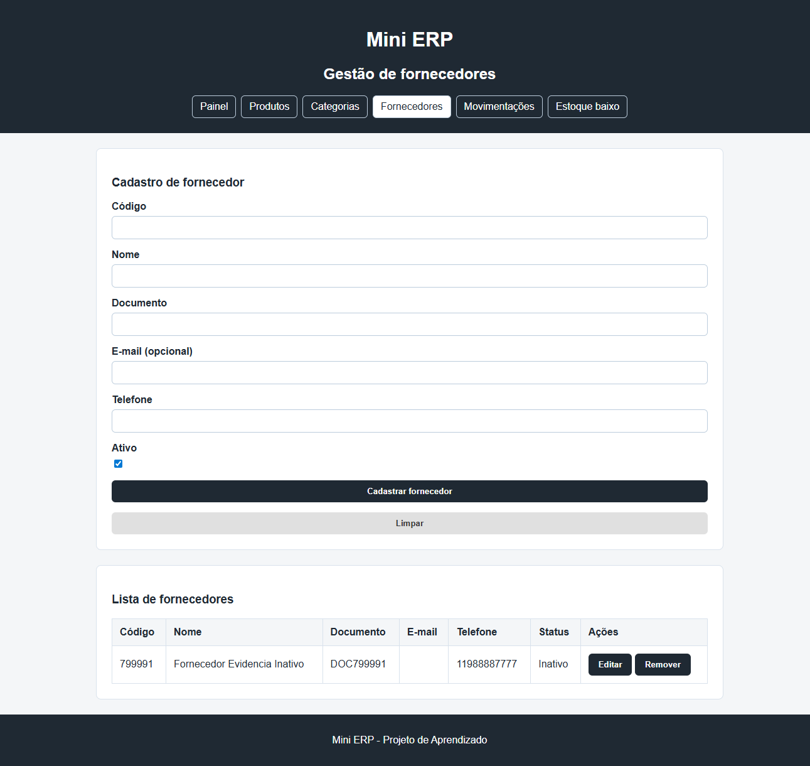
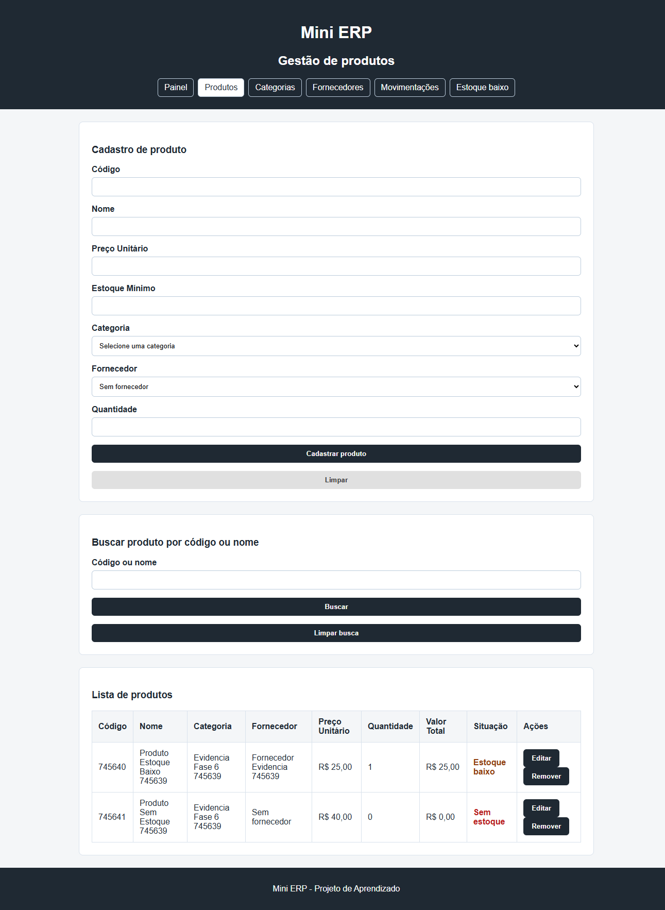
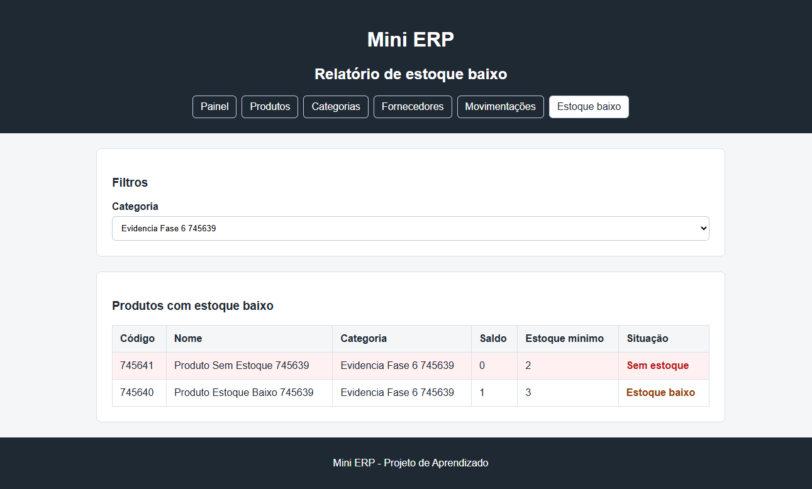

# PR - Consolidacao tecnica da Fase 6

## Resumo

Consolida a estrutura tecnica do Mini ERP e fecha os fluxos de fornecedores e estoque.

## Alteracoes

- Atualiza a documentacao de execucao, arquitetura, SQLite, endpoints e testes.
- Corrige os exemplos de requisicao em `MiniErp.Api.http` para os DTOs atuais.
- Adiciona a consulta `GET /produtos/sem-estoque`.
- Padroniza a mensagem de erro inesperado no frontend.
- Registra o checklist tecnico e as evidencias da Fase 6.
- Mantem fornecedores com telefone, e-mail opcional e inativacao.
- Mantem o relatorio de estoque baixo com filtro por categoria e destaque para saldo zero.

## Como testar

```powershell
C:\Progra~1\dotnet\dotnet.exe build .\MiniErp.slnx
C:\Progra~1\dotnet\dotnet.exe test .\MiniErp.Api.Tests\MiniErp.Api.Tests.csproj
Get-ChildItem .\miniErpWeb\js\*.js | ForEach-Object { node --check $_.FullName }
git diff --check
```

Validacao manual:

1. Aplicar as migrations e iniciar a API em `http://localhost:5208`.
2. Servir `miniErpWeb` em `http://127.0.0.1:5500`.
3. Cadastrar fornecedor com telefone e e-mail vazio.
4. Inativar o fornecedor e confirmar a remocao das novas opcoes de vinculo.
5. Cadastrar produto com estoque baixo e produto sem estoque.
6. Abrir o relatorio, filtrar por categoria e confirmar o destaque do saldo zero.
7. Conferir o console do navegador e o terminal da API.

## Resultado

- Build: aprovado.
- Testes: 29 aprovados.
- Sintaxe JavaScript: aprovada.
- Unicode oculto/bidirecional: nenhuma ocorrencia.
- Integracao manual: aprovada.

## Evidencias visuais







## Checklist

- [x] Codigo revisado.
- [x] Testes locais executados.
- [x] README atualizado.
- [x] Migrations aplicadas.
- [x] API e frontend validados.
- [x] Prints anexados.
- [x] Nenhum caractere Unicode oculto encontrado.
- [x] Console do navegador sem erros com a API ativa.
- [ ] Revisao de outro colaborador.
