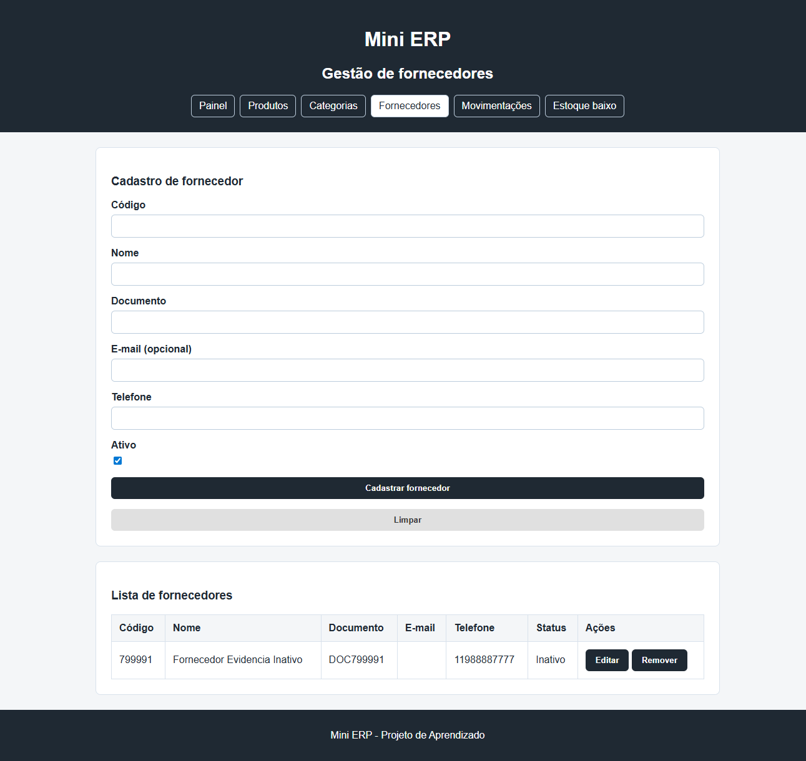
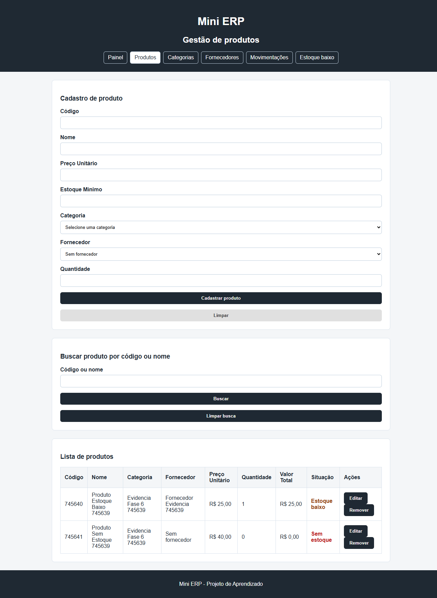
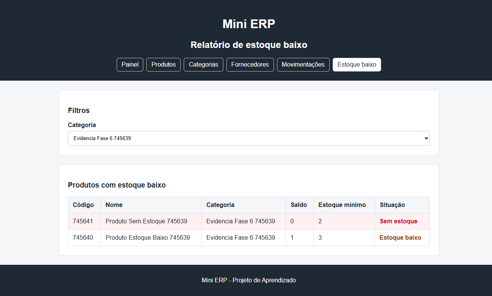

# Validação técnica da Fase 6

Este documento registra as evidências técnicas da Fase 6 do Mini ERP. O escopo considera o funcionamento, a estrutura, a documentação, os testes, a API, o frontend, o SQLite, o CI e o fluxo de revisão. A apresentação e a fixação de conhecimento ficam fora deste checklist por decisão do projeto.

## Checklist de planejamento inicial

- [x] Atualizar README e instruções de execução.
- [x] Revisar a arquitetura e a separação de responsabilidades.
- [x] Organizar chamadas HTTP e mensagens do frontend.
- [x] Revisar regras e testes do backend.
- [x] Implementar e testar fornecedores.
- [x] Implementar e testar relatórios de estoque.
- [x] Preparar checklist, evidências e rascunho de Pull Request.

## Critérios técnicos

- [x] README com visão geral, arquitetura, tecnologias, API, frontend, SQLite, regras, endpoints, testes, fluxo de revisão e próximos passos.
- [x] Frontend usando a API e o SQLite como fonte principal.
- [x] `localStorage` fora do fluxo principal.
- [x] `api.js` concentrando as chamadas HTTP e o tratamento padrão de respostas.
- [x] DTOs usados nos endpoints de criação e edição.
- [x] Services concentrando as regras de negócio.
- [x] Migrations versionando o esquema do SQLite.
- [x] Pelo menos 10 testes automatizados relevantes. O estado atual possui 55 testes.
- [x] Workflow de testes executando em `push` e `pull_request`.
- [x] Template de Pull Request com checklist, comandos e evidências.
- [x] Varredura de caracteres Unicode ocultos e bidirecionais sem ocorrências.
- [x] Validação completa do projeto do zero registrada abaixo.
- [x] Capturas das telas novas realizadas e anexadas como evidência visual.
- [ ] Pull Request aberto, revisado e aprovado.

## Comandos de validação

Executar na raiz do repositório:

```powershell
C:\Progra~1\dotnet\dotnet.exe build .\MiniErp.slnx
C:\Progra~1\dotnet\dotnet.exe test .\MiniErp.Api.Tests\MiniErp.Api.Tests.csproj
Get-ChildItem .\miniErpWeb\js\*.js | ForEach-Object { node --check $_.FullName }
git diff --check
```

Resultado da última execução:

- `dotnet build .\MiniErp.slnx`: aprovado.
- `dotnet test .\MiniErp.Api.Tests\MiniErp.Api.Tests.csproj`: 55 testes aprovados.
- `node --check`: todos os arquivos JavaScript aprovados.
- `git diff --check`: aprovado, sem erros de whitespace.
- Varredura de Unicode oculto e bidirecional: nenhuma ocorrência encontrada.

Para preparar o banco em uma máquina nova:

```powershell
dotnet tool install --global dotnet-ef
dotnet restore .\MiniErp.slnx
dotnet ef database update --project .\MiniErp.Api --startup-project .\MiniErp.Api
```

## Validação manual

- [x] API iniciada em `http://localhost:5208`.
- [x] Frontend servido em `http://127.0.0.1:5500`.
- [x] Categorias carregadas pela API.
- [x] Produto cadastrado com categoria válida.
- [x] Entrada e saída registradas com histórico.
- [x] Fornecedor cadastrado com telefone e e-mail vazio.
- [x] Fornecedor inativado e removido das novas opções de vínculo.
- [x] Relatório de estoque baixo exibindo saldo menor ou igual ao mínimo.
- [x] Filtro do relatório por categoria funcionando.
- [x] Produto sem estoque destacado na tabela.
- [x] Mensagem compreensível exibida quando a API fica indisponível.
- [x] Console do navegador sem erros com a API ativa.
- [x] Terminal da API sem erros.

Resultado da integração com dados temporários:

- Cadastro de produto: `201 Created`.
- Entrada de estoque: `201 Created`.
- Saída de estoque: `201 Created`.
- Histórico: 2 movimentações retornadas.
- Estoque baixo: produto encontrado.
- Filtro por categoria: produto correto encontrado.
- Produtos sem estoque: produto com saldo zero encontrado.
- Inativação de fornecedor: status alterado para inativo.
- E-mail vazio: aceito sem erro.
- Registros temporários removidos ao final do teste.
- Com a API desligada, o frontend exibiu mensagem compreensível; o evento de rede recusada foi tratado sem expor erro técnico na interface.

## Evidências visuais

As capturas de tela devem ser mantidas junto ao projeto e anexadas ao Pull Request:







## Evidências do CI

- [Workflow de testes](https://github.com/Fernando-0904/mini---erp/actions/workflows/tests.yml)
- [Workflow do GitHub Pages](https://github.com/Fernando-0904/mini---erp/actions/workflows/pages.yml)
- Commits publicados da funcionalidade: `5f213be` e `85c2191`.

## Roteiro do Pull Request

1. Descrever o objetivo e o impacto da alteração.
2. Marcar o tipo de alteração no template.
3. Informar os comandos executados.
4. Anexar as capturas de tela e o resultado dos testes.
5. Marcar o checklist somente após revisar o código.
6. Solicitar revisão antes do merge.
